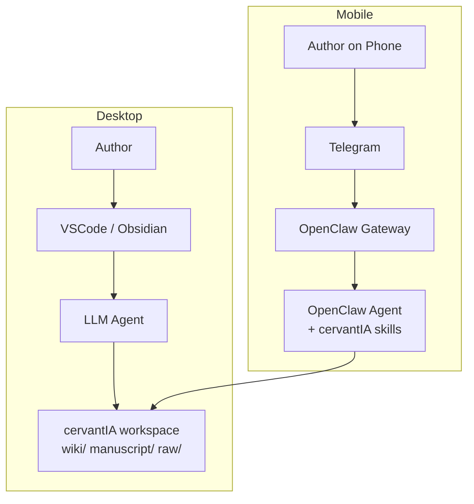

# cervantIA

> **A Narrative Engine and Book Wiki system for the modern AI author.**

---

### ✨ This is a **Vibe Coding** experiment.
*I built this project for my girlfriend so she can write her fanfics with perfect continuity.*

---

## 🎭 Overview

**cervantIA** is an automated knowledge base and writing assistant designed to maintain strict narrative continuity across complex literary works. It treats your story as a living database, ensuring that characters don't forget their eye color, locations stay where they belong, and timelines never collapse into paradoxes.

## 🛠️ The Canonical Workflow

The system is built around a four-stage iterative process:

1.  **`query`** — Pull relevant context from the Wiki (characters, lore, history).
2.  **`write`** — Draft prose in the `manuscript/` following the established `style_guide`.
3.  **`ingest`** — Automatically update the Wiki with new details introduced in the latest draft.
4.  **`lint`** — Check for continuity errors or style violations before finalizing.

## 📂 Project Structure

-   `manuscript/`: The creative heart. Contains the drafts and final chapters.
-   `wiki/`: The source of truth. Auto-maintained entity records and plot timelines.
-   `raw/`: The memory bank. Immutable sources and research material.
-   `.agents/skills/`: Modular skills and instructions for the AI tools.
-   `AGENTS.md`: The token-optimized, always-on context injected into the LLM's system prompt.

## 🧩 Entity Management (`wiki/`)

The Wiki tracks narrative elements using standardized markdown files:
-   **Characters** (`characters/[name].md`): YAML records of traits, arcs, voices, and relationships.
-   **Locations** (`locations/[name].md`): Sensory details, historical lore, and key features.
-   **Plot & Timeline** (`plot/timeline.md`): Chronological sequence of events and unresolved threads.
-   **Worldbuilding** (`worldbuilding/[topic].md`): Factions, technology, and cultural norms.
-   **Style Guide** (`style_guide.md`): Configurable constraints for tone, language, and formatting.

---

## 📱 Mobile Writing (via OpenClaw + Telegram)

cervantIA can be used from your phone via **Telegram**, powered by [OpenClaw](https://openclaw.ai). Send messages to your bot to query the wiki, draft chapters, ingest notes, or run consistency checks — all from a chat interface.

Both desktop and mobile share the **same workspace** — changes from Telegram are immediately visible in VSCode/Obsidian, and vice versa.



## 🚀 Installation

### Desktop (VSCode / Cursor / Local Agents)

If you are writing primarily on your desktop using your own AI agent:

1. **Clone the repository** (or download as a ZIP and extract it):
   ```bash
   git clone https://github.com/<your-username>/cervantIA.git
   cd cervantIA
   ```
2. Open the `cervantIA` folder in your preferred editor.
3. Your local AI agent will automatically read `AGENTS.md` and the `.agents/skills/` directory to understand the project structure and workflows.

### Mobile & Remote (OpenClaw)

You can ask your OpenClaw agent to install **cervantIA** directly from GitHub. Just send your agent the following prompt:

```text
Install the skill "cervantIA" from GitHub: https://github.com/<your-username>/cervantIA.
Keep the work scoped to this skill only.
After install, inspect the skill metadata and help me finish setup.
Ask before making any broader environment changes.
```

The agent will handle cloning the repository, installing the skills into your workspace, and guiding you through the rest of the setup.

For full OpenClaw and Telegram channel setup, see the [OpenClaw Telegram docs](https://docs.openclaw.ai/channels/telegram).

---

*CervantIA: Because every great story needs a perfect memory.*
